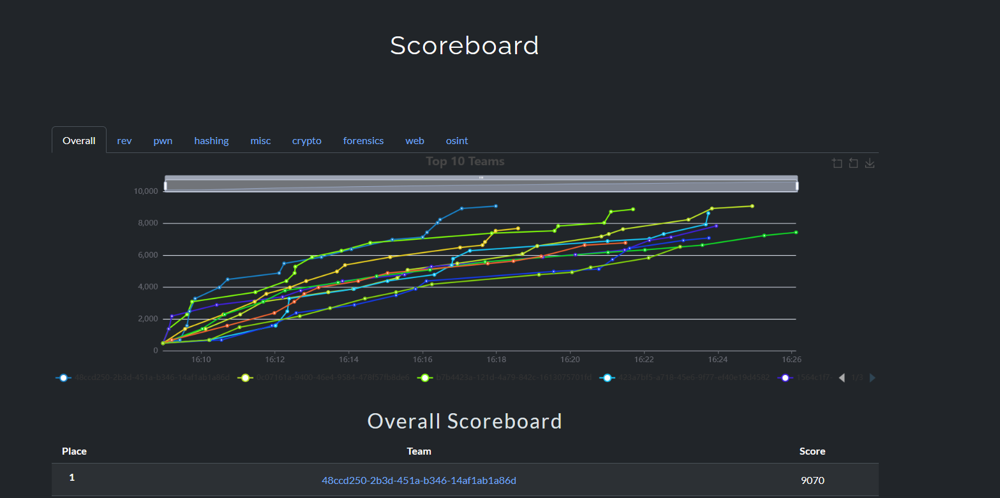
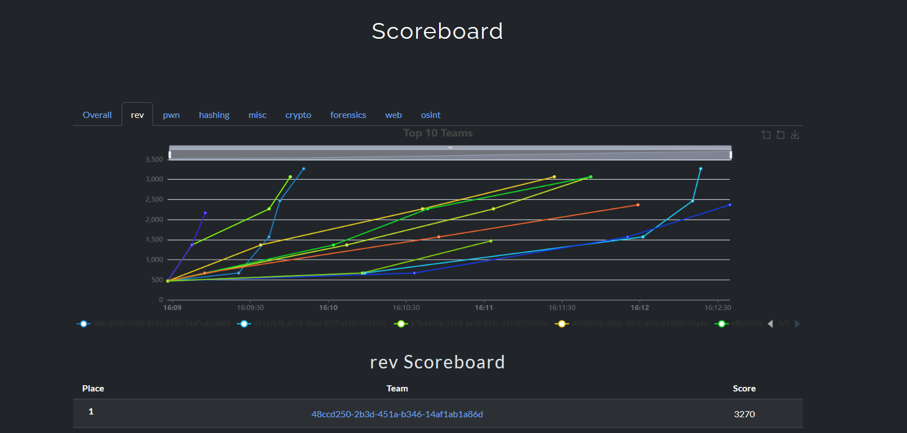

# CTFd Category Scoreboard

Plugin to divide the CTFd scoreboard across challenge categories.

Note: This plugin currently only supports running in Teams mode.


## Scoreboard

The scoreboard now has tabs based on category.



The first tab will show the overall, i.e., normal scoreboard.

All following tabs will show the scores based on individual categories



## Installation

To install the plugin go into the `CTFd/plugins/` directory and clone the plugin with:

```sh
git clone https://github.com/SlugMaster1/CTFd_category_scoreboard.git
```

Afterwords you will need to restart your CTFd instance if it is currently running.

## Notice

This plugin was tested on CTFd version 3.8.0, but should work for other versions. If you notice an 
issue with a certain version feel free to open an issue or a pull request.

## Acknowledgements
Much of this code is based on [durkinza's](https://github.com/durkinza) work on the [CTFd Split Scoreboard](https://github.com/durkinza/CTFd_Split_Scoreboard/) plugin. 
